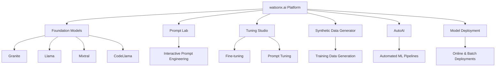
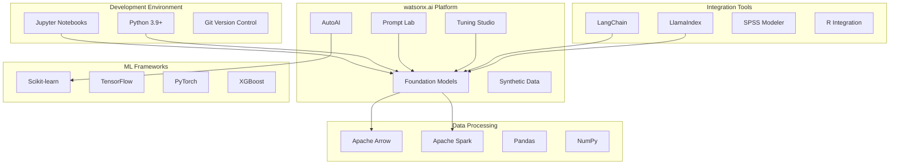
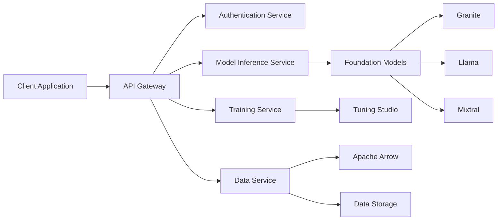

# 🎓 Houston Community College - watsonx.ai Learning Hub


Welcome to the Houston Community College watsonx.ai Learning Hub! This repository provides a comprehensive introduction to IBM watsonx.ai for students of all skill levels, featuring hands-on notebooks, tutorials, and real-world examples.

## 📚 Table of Contents

- [Welcome & Introduction](#-welcome--introduction)
- [What is watsonx.ai?](#-what-is-watsonxai)
- [Prerequisites & Setup](#-prerequisites--setup)
- [Architecture & Technology Stack](#-architecture--technology-stack)
- [Gen AI Stack Deep Dive](#-gen-ai-stack-deep-dive)
- [Learning Paths](#-learning-paths)
- [Notebook Catalog](#-notebook-catalog)
- [Resources & Documentation](#-resources--documentation)
- [Quick Start Guide](#-quick-start-guide)
- [Troubleshooting & FAQ](#-troubleshooting--faq)
- [Contributing](#-contributing)

---

## 🌟 Welcome & Introduction

Welcome, HCC students! This learning hub is designed to introduce you to the exciting world of artificial intelligence using IBM's watsonx.ai platform. Whether you're new to AI or looking to expand your skills, you'll find structured learning paths and hands-on examples to guide your journey.

### What You'll Learn

- 🤖 **Foundation Models**: Work with state-of-the-art language models like Granite, Llama, and Mixtral
- 📚 **RAG Systems**: Build Retrieval Augmented Generation applications
- 🔬 **AutoAI**: Automate machine learning workflows
- 🚀 **Deployments**: Deploy models to production
- 🎯 **Prompt Engineering**: Master the art of crafting effective prompts
- 🔧 **Fine-tuning**: Customize models for specific tasks

### Why watsonx.ai?

watsonx.ai is IBM's enterprise-ready AI platform that combines:
- Access to cutting-edge foundation models
- Tools for prompt engineering and model tuning
- Enterprise-grade security and governance
- Integration with existing data infrastructure
- Support for the full AI lifecycle

---

## 🔍 What is watsonx.ai?

watsonx.ai is IBM's next-generation enterprise studio for AI builders to train, validate, tune, and deploy both traditional machine learning and generative AI capabilities powered by foundation models.

### Key Capabilities



### Platform Components

| Component | Description | Use Cases |
|-----------|-------------|-----------|
| **Foundation Models** | Pre-trained large language models | Text generation, Q&A, summarization, code generation |
| **Prompt Lab** | Interactive prompt engineering interface | Test prompts, compare models, save templates |
| **Tuning Studio** | Model customization tools | Fine-tune models, prompt tuning, evaluate performance |
| **Synthetic Data Generator** | Create training data from seed examples | Data augmentation, scenario generation |
| **AutoAI** | Automated machine learning | Classification, regression, time series forecasting |
| **Deployments** | Model serving infrastructure | REST APIs, batch processing, real-time inference |

---

## 🛠️ Prerequisites & Setup

### Prerequisites Checklist

- [ ] **IBM Cloud Account** - [Sign up for free](https://cloud.ibm.com/registration)
- [ ] **Python 3.9+** - [Download Python](https://www.python.org/downloads/)
- [ ] **Git** - [Install Git](https://git-scm.com/downloads)
- [ ] **Jupyter** - Installed via pip (see below)
- [ ] **Basic Python Knowledge** - Variables, functions, loops
- [ ] **Text Editor/IDE** - VS Code, PyCharm, or similar

### Step-by-Step Setup

#### 1. Create IBM Cloud Account

1. Visit [IBM Cloud Registration](https://cloud.ibm.com/registration)
2. Sign up for a free account (no credit card required for lite tier)
3. Verify your email address
4. Log in to IBM Cloud console

#### 2. Set Up watsonx.ai Service

1. Navigate to the [watsonx.ai service](https://cloud.ibm.com/catalog/services/watsonx-ai)
2. Click "Create" to provision the service
3. Create a new project or select an existing one
4. Note your **Project ID** (found in project settings)

#### 3. Get API Credentials

1. Go to [IBM Cloud API Keys](https://cloud.ibm.com/iam/apikeys)
2. Click "Create an IBM Cloud API key"
3. Give it a descriptive name (e.g., "watsonx-learning")
4. **Save the API key securely** - you won't be able to see it again!

#### 4. Clone This Repository

```bash
# Clone the repository
git clone https://github.com/your-org/hcc-wx-ai.git
cd hcc-wx-ai

# Create a virtual environment
python -m venv venv

# Activate virtual environment
# On macOS/Linux:
source venv/bin/activate
# On Windows:
venv\Scripts\activate
```

#### 5. Install Dependencies

```bash
# Install required packages
pip install --upgrade pip
pip install ibm-watsonx-ai jupyter pandas numpy matplotlib

# Or install from requirements file (if available)
pip install -r requirements.txt
```

#### 6. Configure Credentials

Create a `.env` file in the project root:

```bash
# Create .env file
cat > .env << EOF
WATSONX_API_KEY=your_api_key_here
WATSONX_PROJECT_ID=your_project_id_here
WATSONX_URL=https://us-south.ml.cloud.ibm.com
EOF
```

**Security Note**: Never commit your `.env` file to Git! It's already in `.gitignore`.

#### 7. Verify Installation

```python
# Test your setup
from ibm_watsonx_ai import Credentials
from ibm_watsonx_ai.foundation_models import ModelInference
import os
from dotenv import load_dotenv

# Load credentials
load_dotenv()
api_key = os.getenv('WATSONX_API_KEY')
project_id = os.getenv('WATSONX_PROJECT_ID')
url = os.getenv('WATSONX_URL')

# Create credentials
credentials = Credentials(url=url, api_key=api_key)

# Test connection
try:
    model = ModelInference(
        model_id="ibm/granite-13b-instruct-v2",
        credentials=credentials,
        project_id=project_id
    )
    print("✓ Setup successful! You're ready to start learning.")
except Exception as e:
    print(f"✗ Setup error: {e}")
```

---

## 🏗️ Architecture & Technology Stack

### 🔧 Technology Stack Overview



### 💡 Core Technologies

#### Apache Arrow
**Purpose**: High-performance data interchange format

- **Zero-copy data sharing** between processes
- **Columnar memory format** for efficient analytics
- **Fast serialization/deserialization**
- **Language-agnostic** data structures
- **Reduces memory overhead** in data pipelines

**Why it matters**: Arrow enables watsonx.ai to efficiently transfer large datasets between services without copying data, significantly improving performance.

#### Microservices Architecture
**Purpose**: Scalable, modular service design



**Benefits**:
- Independent scaling of services
- Technology diversity (Python, R, Java)
- Fault isolation
- Easier maintenance and updates
- Parallel development

#### Jupyter Notebooks
**Purpose**: Interactive development environment

- **Rich visualization** support
- **Markdown documentation** alongside code
- **Code versioning** and sharing
- **Collaborative** features
- **Reproducible** research

#### Apache Spark
**Purpose**: Distributed computing framework

- **Large-scale data processing**
- **In-memory computation**
- **MLlib** for machine learning
- **Integration** with watsonx.ai
- **Scalable** model training

#### R Integration
**Purpose**: Statistical computing and graphics

- **Statistical analysis** capabilities
- **Data visualization** with ggplot2
- **R Shiny** for interactive apps
- **Integration** with watsonx.ai models
- **Rich ecosystem** of packages

#### SPSS Modeler
**Purpose**: Visual data science tool

- **Drag-and-drop** interface
- **No-code** model building
- **Enterprise-grade** analytics
- **Integration** with watsonx.ai
- **Deployment** to production

---

## 🚀 Gen AI Stack Deep Dive

### 📚 Foundation Model Library

watsonx.ai provides access to a curated library of foundation models:

| Model Family | Models | Best For | Context Length |
|--------------|--------|----------|----------------|
| **IBM Granite** | granite-13b-instruct-v2<br>granite-20b-multilingual | Business tasks, RAG, multilingual | 8K tokens |
| **Meta Llama** | llama-3-70b-instruct<br>llama-2-70b-chat | General purpose, Q&A, chat | 8K tokens |
| **Mistral AI** | mixtral-8x7b-instruct-v01 | Code, reasoning, multilingual | 32K tokens |
| **CodeLlama** | codellama-34b-instruct-hf | Code generation, debugging | 16K tokens |
| **Time Series** | granite-timeseries-ttm-v1 | Forecasting, anomaly detection | Variable |

### 🎯 Prompt Lab

**Interactive prompt engineering interface** for testing and refining prompts.

**Key Features**:
- 🎯 **Multi-model comparison** - Test same prompt across different models
- 📝 **Prompt templates** - Save and reuse effective prompts
- ⚙️ **Parameter tuning** - Adjust temperature, top_p, max_tokens
- 📊 **Response analysis** - Compare outputs side-by-side
- 💾 **Version control** - Track prompt iterations

**Example Workflow**:
```python
# Using Prompt Lab programmatically
from ibm_watsonx_ai.foundation_models import ModelInference

model = ModelInference(
    model_id="ibm/granite-13b-instruct-v2",
    credentials=credentials,
    project_id=project_id
)

# Test different prompts
prompts = [
    "Summarize this text:",
    "Provide a brief summary of:",
    "In 2-3 sentences, summarize:"
]

for prompt in prompts:
    response = model.generate_text(
        prompt=f"{prompt}\n\n{text}",
        params={"max_new_tokens": 100}
    )
    print(f"Prompt: {prompt}\nResponse: {response}\n")
```

### 🔧 Tuning Studio

**Customize foundation models** for your specific use cases.

#### Fine-Tuning
**Full model weight updates** for maximum customization.

- **Use when**: You have substantial labeled data (1000+ examples)
- **Benefits**: Highest accuracy for specific tasks
- **Considerations**: Requires more compute and time

```python
# Fine-tuning example
from ibm_watsonx_ai.foundation_models.utils import FineTuning

fine_tuning = FineTuning(
    model_id="ibm/granite-13b-instruct-v2",
    credentials=credentials,
    project_id=project_id
)

# Start fine-tuning job
job = fine_tuning.run(
    training_data_reference=training_data,
    validation_data_reference=validation_data,
    hyperparameters={
        "learning_rate": 0.0001,
        "num_epochs": 3,
        "batch_size": 8
    }
)
```

#### Prompt Tuning
**Efficient task adaptation** with learnable tokens.

- **Use when**: You have limited data (100-1000 examples)
- **Benefits**: Fast, efficient, preserves base model
- **Considerations**: May not match fine-tuning accuracy

```python
# Prompt tuning example
from ibm_watsonx_ai.foundation_models import PromptTuning

prompt_tuning = PromptTuning(
    model_id="ibm/granite-13b-instruct-v2",
    credentials=credentials,
    project_id=project_id
)

# Start prompt tuning
tuning_job = prompt_tuning.run(
    training_data=training_data,
    task_description="Classify customer sentiment",
    num_virtual_tokens=20
)
```

### 🧪 Synthetic Data Generator

**Create high-quality training data** from seed examples.

**Use Cases**:
- 📈 **Data augmentation** - Expand small datasets
- 🎭 **Scenario generation** - Create diverse examples
- 🔒 **Privacy preservation** - Generate synthetic alternatives
- 🧪 **Testing** - Create edge cases

**Example**:
```python
# Generate synthetic data
from ibm_watsonx_ai.foundation_models import ModelInference

model = ModelInference(
    model_id="ibm/granite-13b-instruct-v2",
    credentials=credentials,
    project_id=project_id
)

# Seed examples
seed_examples = [
    "Customer loved the product, 5 stars!",
    "Terrible experience, would not recommend."
]

# Generate variations
prompt = f"""Generate 10 variations of customer reviews similar to these examples:
{chr(10).join(seed_examples)}

Generate diverse reviews with different sentiments and writing styles:"""

synthetic_data = model.generate_text(prompt, params={"max_new_tokens": 500})
```

### 🤖 AutoAI

**Automated machine learning** for rapid model development.

**Capabilities**:
- 🤖 **Automated feature engineering**
- 🔍 **Algorithm selection**
- ⚙️ **Hyperparameter optimization**
- 📊 **Model comparison**
- 🚀 **One-click deployment**

**Supported Tasks**:
- Binary and multiclass classification
- Regression
- Time series forecasting
- Fairness-aware modeling

```python
# AutoAI example
from ibm_watsonx_ai.experiment import AutoAI

autoai = AutoAI(
    credentials=credentials,
    project_id=project_id
)

# Run experiment
experiment = autoai.runs.create(
    training_data_references=[data_reference],
    training_results_reference=results_reference,
    prediction_type='classification',
    prediction_column='target',
    max_num_daub_ensembles=3,
    cognito_transform_names=['PCA', 'FeatureAgglomeration']
)

# Monitor progress
experiment.monitor_logs()

# Get best pipeline
best_pipeline = experiment.get_pipeline(pipeline_name='Pipeline_1')
```

---

## 🎯 Learning Paths

Choose your learning path based on your experience level and goals.

### 🟢 Beginner Path (4-6 hours)

**Prerequisites**: Basic Python knowledge

**Learning Objectives**:
- ✅ Understand foundation models and their capabilities
- ✅ Write effective prompts for different tasks
- ✅ Generate text, code, and summaries
- ✅ Deploy a simple model

**Recommended Sequence**:

1. **Introduction to Foundation Models** (30 min)
   - 📓 `Use watsonx, and granite-13b-instruct to analyze car rental customer satisfaction.ipynb`
   - Learn: Basic model inference, prompt structure, response handling

2. **Question Answering** (45 min)
   - 📓 `Use watsonx, and Meta llama-3-70b-instruct to answer question about an article.ipynb`
   - Learn: Context-based Q&A, prompt engineering

3. **Code Generation** (45 min)
   - 📓 `Use watsonx, and codellama-34b-instruct-hf to generate code based on instruction.ipynb`
   - Learn: Code generation, debugging assistance

4. **Multilingual Support** (30 min)
   - 📓 `Use watsonx, and granite-20b-multilingual to support multiple languages translation.ipynb`
   - Learn: Translation, multilingual capabilities

5. **Prompt Templates** (45 min)
   - 📓 `Use watsonx to manage Prompt Template assets and create deployment.ipynb`
   - Learn: Template management, reusable prompts

6. **Simple Deployment** (45 min)
   - 📓 Choose a deployment notebook from `notebooks/python_sdk/deployments/`
   - Learn: Model deployment basics

**Next Steps**: Move to Intermediate Path or explore specific topics of interest.

---

### 🟡 Intermediate Path (8-12 hours)

**Prerequisites**: Completed Beginner Path or equivalent experience

**Learning Objectives**:
- ✅ Build RAG (Retrieval Augmented Generation) systems
- ✅ Use AutoAI for automated machine learning
- ✅ Integrate LangChain for complex workflows
- ✅ Deploy production-ready models
- ✅ Implement time series forecasting

**Recommended Sequence**:

1. **RAG Fundamentals** (2 hours)
   - 📓 Notebooks in `notebooks/python_sdk/deployments/foundation_models/RAG/`
   - Learn: Document retrieval, context injection, vector databases

2. **LangChain Integration** (2 hours)
   - 📓 `Use watsonx, and LangChain to make a series of calls to a language model.ipynb`
   - 📓 `Use watsonx, and LangChain Agents to perform sequence of actions.ipynb`
   - Learn: Chains, agents, memory, tools

3. **AutoAI Experiments** (2 hours)
   - 📓 `Use AutoAI and Lale to predict credit risk.ipynb`
   - 📓 `Use AutoAI and timeseries data to predict COVID cases.ipynb`
   - Learn: Automated ML, pipeline optimization

4. **Time Series Forecasting** (2 hours)
   - 📓 `Use Time Series Foundation Models and timeseries data to predict energy demand.ipynb`
   - Learn: Time series models, forecasting techniques

5. **Advanced Deployments** (2 hours)
   - 📓 Explore `notebooks/python_sdk/deployments/` subdirectories
   - Learn: Batch deployments, online serving, monitoring

**Next Steps**: Move to Advanced Path or specialize in a specific area.

---

### 🔴 Advanced Path (15-20 hours)

**Prerequisites**: Completed Intermediate Path or significant ML experience

**Learning Objectives**:
- ✅ Fine-tune foundation models
- ✅ Implement advanced RAG with LangGraph
- ✅ Build federated learning systems
- ✅ Create custom deployments
- ✅ Optimize for production

**Recommended Sequence**:

1. **Model Fine-Tuning** (4 hours)
   - 📓 Notebooks in `notebooks/python_sdk/deployments/foundation_models/fine_tuning/`
   - Learn: Full fine-tuning, prompt tuning, evaluation

2. **Advanced RAG with LangGraph** (3 hours)
   - 📓 `Use watsonx, and LangGraph to build Adaptive RAG Graph.ipynb`
   - Learn: Graph-based RAG, adaptive retrieval, state management

3. **LlamaIndex Integration** (3 hours)
   - 📓 `Use watsonx, and LlamaIndex with sql querey engine.ipynb`
   - Learn: SQL integration, structured data retrieval

4. **Federated Learning** (3 hours)
   - 📓 Notebooks in `notebooks/python_sdk/experiments/federated_learning/`
   - Learn: Distributed training, privacy-preserving ML

5. **AutoAI RAG** (2 hours)
   - 📓 Notebooks in `notebooks/python_sdk/experiments/autoai_rag/`
   - Learn: Automated RAG optimization

6. **Production Optimization** (4 hours)
   - 📓 Model benchmarking notebooks
   - 📓 Custom deployment examples
   - Learn: Performance tuning, monitoring, scaling

**Next Steps**: Contribute to the repository, build your own projects, mentor others.

---

## 📖 Notebook Catalog

### 🤖 Foundation Models & Text Generation

#### 🟢 Beginner Level

| Notebook | Duration | Topics | Description |
|----------|----------|--------|-------------|
| **Granite Customer Satisfaction** | 30 min | 🤖 Foundation Models, 🎯 Prompts | Analyze customer feedback using Granite model |
| **Llama Q&A** | 45 min | 🤖 Foundation Models, 📚 Q&A | Answer questions about articles using Llama 3 |
| **Multilingual Translation** | 30 min | 🤖 Foundation Models, 🌍 Translation | Translate text across multiple languages |

#### 🟡 Intermediate Level

| Notebook | Duration | Topics | Description |
|----------|----------|--------|-------------|
| **CodeLlama Code Generation** | 1 hour | 🤖 Foundation Models, 💻 Code | Generate code from natural language instructions |
| **Mixtral Legal Analysis** | 1 hour | 🤖 Foundation Models, ⚖️ Legal | Analyze legal documents and contracts |
| **Contract Summarization** | 1 hour | 🤖 Foundation Models, 📄 Summarization | Summarize complex legal contracts |

### 📚 RAG (Retrieval Augmented Generation)

#### 🟡 Intermediate Level

| Notebook | Duration | Topics | Description |
|----------|----------|--------|-------------|
| **Basic RAG Implementation** | 2 hours | 📚 RAG, 🔍 Retrieval | Build a simple RAG system |
| **LangChain Series of Calls** | 1.5 hours | 📚 RAG, 🔗 LangChain | Chain multiple model calls together |
| **LangChain Agents** | 2 hours | 📚 RAG, 🤖 Agents | Build autonomous agents with tools |

#### 🔴 Advanced Level

| Notebook | Duration | Topics | Description |
|----------|----------|--------|-------------|
| **Adaptive RAG with LangGraph** | 3 hours | 📚 RAG, 🕸️ Graphs | Build adaptive RAG with state management |
| **LlamaIndex SQL Engine** | 2 hours | 📚 RAG, 🗄️ SQL | Query structured data with natural language |

### 🔬 AutoAI & Experiments

#### 🟡 Intermediate Level

| Notebook | Duration | Topics | Description |
|----------|----------|--------|-------------|
| **Credit Risk Prediction** | 2 hours | 🔬 AutoAI, 💳 Classification | Predict credit risk with AutoAI |
| **COVID Cases Forecasting** | 2 hours | 🔬 AutoAI, 📈 Time Series | Forecast COVID cases using time series |
| **PM2.5 Prediction** | 2 hours | 🔬 AutoAI, 🌍 Environment | Predict air quality with supporting features |

#### 🔴 Advanced Level

| Notebook | Duration | Topics | Description |
|----------|----------|--------|-------------|
| **Large Tabular Problems** | 3 hours | 🔬 AutoAI, 📊 Big Data | Handle large datasets with BatchedTreeEnsemble |
| **AutoAI Fairness** | 2 hours | 🔬 AutoAI, ⚖️ Fairness | Build fair and unbiased models |
| **AutoAI RAG** | 3 hours | 🔬 AutoAI, 📚 RAG | Automated RAG optimization |

### 🚀 Model Deployments

#### 🟢 Beginner Level

| Framework | Notebooks | Topics |
|-----------|-----------|--------|
| **Scikit-learn** | `notebooks/python_sdk/deployments/scikit-learn/` | 🚀 Deployment, 🔬 ML |
| **Python Functions** | `notebooks/python_sdk/deployments/python_function/` | 🚀 Deployment, 🐍 Python |

#### 🟡 Intermediate Level

| Framework | Notebooks | Topics |
|-----------|-----------|--------|
| **TensorFlow** | `notebooks/python_sdk/deployments/tensorflow/` | 🚀 Deployment, 🧠 Deep Learning |
| **PyTorch** | `notebooks/python_sdk/deployments/pytorch/` | 🚀 Deployment, 🔥 Deep Learning |
| **Spark MLlib** | `notebooks/python_sdk/deployments/spark/` | 🚀 Deployment, ⚡ Spark |
| **XGBoost** | `notebooks/python_sdk/deployments/xgboost/` | 🚀 Deployment, 🌳 Boosting |

#### 🔴 Advanced Level

| Framework | Notebooks | Topics |
|-----------|-----------|--------|
| **Custom Libraries** | `notebooks/python_sdk/deployments/custom_library/` | 🚀 Deployment, 🔧 Custom |
| **Custom Software Specs** | `notebooks/python_sdk/deployments/custom_software_spec/` | 🚀 Deployment, ⚙️ Advanced |
| **AI Services** | `notebooks/python_sdk/deployments/ai_services/` | 🚀 Deployment, 🤖 Services |

### ⚙️ Specialized Services

#### 🟡 Intermediate Level

| Service | Notebooks | Topics | Description |
|---------|-----------|--------|-------------|
| **Text Extraction** | `Use watsonx Text Extraction service...ipynb` | 📄 OCR, 🔍 Extraction | Extract text from PDFs and images |
| **Time Series BYOM** | `Use Time Series BYOM...ipynb` | 📈 Forecasting, 🔮 Prediction | Bring your own time series model |
| **Decision Optimization** | `notebooks/python_sdk/deployments/decision_optimization/` | 🎯 Optimization, 📊 Operations | Solve optimization problems |

---

## 📚 Resources & Documentation

### 📖 Official IBM watsonx.ai Documentation

#### Getting Started
- 🌐 [watsonx.ai Welcome Guide](https://dataplatform.cloud.ibm.com/docs/content/wsj/getting-started/welcome-main.html?context=wx&audience=wdp)
- 📖 [Python SDK Documentation](https://ibm.github.io/watsonx-ai-python-sdk/v1.4.7/samples.html)
- 🔧 [API Reference](https://cloud.ibm.com/apidocs/watsonx-ai)
- 🚀 [Quick Start Guide](https://dataplatform.cloud.ibm.com/docs/content/wsj/getting-started/quick-start.html)

#### Foundation Models
- 🤖 [Foundation Models Overview](https://dataplatform.cloud.ibm.com/docs/content/wsj/analyze-data/fm-models.html)
- 🎯 [Prompt Lab Guide](https://dataplatform.cloud.ibm.com/docs/content/wsj/analyze-data/fm-prompt-lab.html)
- 🔧 [Tuning Studio](https://dataplatform.cloud.ibm.com/docs/content/wsj/analyze-data/fm-tuning-studio.html)
- 📊 [Model Cards](https://dataplatform.cloud.ibm.com/docs/content/wsj/analyze-data/fm-model-cards.html)

#### AutoAI
- 🔬 [AutoAI Overview](https://dataplatform.cloud.ibm.com/docs/content/wsj/analyze-data/autoai-overview.html)
- 📈 [Time Series Experiments](https://dataplatform.cloud.ibm.com/docs/content/wsj/analyze-data/autoai-timeseries.html)
- ⚖️ [Fairness and Bias](https://dataplatform.cloud.ibm.com/docs/content/wsj/analyze-data/autoai-fairness.html)

#### Deployments
- 🚀 [Deployment Overview](https://dataplatform.cloud.ibm.com/docs/content/wsj/analyze-data/ml-deploy-general.html)
- 🌐 [Online Deployments](https://dataplatform.cloud.ibm.com/docs/content/wsj/analyze-data/ml-deploy-online.html)
- 📦 [Batch Deployments](https://dataplatform.cloud.ibm.com/docs/content/wsj/analyze-data/ml-deploy-batch.html)

### 📚 Technology Stack Documentation

#### Data Processing
- 🏹 [Apache Arrow](https://arrow.apache.org/docs/) - Columnar data format
- ⚡ [Apache Spark](https://spark.apache.org/docs/latest/) - Distributed computing
- 🐼 [Pandas](https://pandas.pydata.org/docs/) - Data manipulation
- 🔢 [NumPy](https://numpy.org/doc/) - Numerical computing

#### Development Tools
- 📓 [Jupyter](https://jupyter.org/documentation) - Interactive notebooks
- 🐍 [Python](https://docs.python.org/3/) - Programming language
- 📊 [R Project](https://www.r-project.org/other-docs.html) - Statistical computing

#### ML Frameworks
- 🔬 [Scikit-learn](https://scikit-learn.org/stable/documentation.html) - Traditional ML
- 🧠 [TensorFlow](https://www.tensorflow.org/api_docs) - Deep learning
- 🔥 [PyTorch](https://pytorch.org/docs/stable/index.html) - Deep learning
- 🌳 [XGBoost](https://xgboost.readthedocs.io/) - Gradient boosting

#### Integration Libraries
- 🔗 [LangChain](https://python.langchain.com/docs/get_started/introduction) - LLM applications
- 🦙 [LlamaIndex](https://docs.llamaindex.ai/) - Data framework for LLMs
- 📊 [SPSS Modeler](https://www.ibm.com/docs/en/spss-modeler) - Visual data science

### 🐍 Python SDK Resources

#### Installation & Setup
```bash
# Install watsonx.ai SDK
pip install ibm-watsonx-ai

# Install with optional dependencies
pip install ibm-watsonx-ai[langchain]
pip install ibm-watsonx-ai[ray]
```

#### Key Packages
- `ibm-watsonx-ai` - Main SDK package
- `ibm-watson-machine-learning` - Legacy ML package
- `ibm-cloud-sdk-core` - Core IBM Cloud SDK

### 🎓 Learning Resources

#### IBM Learning Platforms
- 🎓 [IBM Skills Network](https://skills.network/) - Free courses and labs
- 📚 [watsonx.ai Resource Hub](https://www.ibm.com/watsonx/resources) - Guides and tutorials
- 💻 [IBM Developer](https://developer.ibm.com/technologies/artificial-intelligence/) - Technical articles
- 🎯 [Cognitive Class](https://cognitiveclass.ai/) - AI and data science courses

#### Community & Support
- 💬 [IBM Community Forums](https://community.ibm.com/community/user/watsonx/home) - Ask questions
- 📝 [Stack Overflow](https://stackoverflow.com/questions/tagged/watsonx) - Technical Q&A
- 🐛 [GitHub Issues](https://github.com/IBM/watsonx-ai-python-sdk/issues) - Report bugs
- 📧 [IBM Support](https://www.ibm.com/mysupport) - Official support

#### Video Tutorials
- 🎥 [watsonx.ai YouTube Channel](https://www.youtube.com/@IBMTechnology) - Video tutorials
- 📺 [IBM Developer YouTube](https://www.youtube.com/@IBMDeveloper) - Technical deep dives

### 📚 Additional Resources

#### Research Papers
- 📄 [Granite Model Papers](https://www.ibm.com/granite) - IBM's foundation models
- 📄 [RAG Papers](https://arxiv.org/abs/2005.11401) - Retrieval Augmented Generation
- 📄 [Prompt Tuning](https://arxiv.org/abs/2104.08691) - Efficient model adaptation

#### Best Practices
- ✅ [Prompt Engineering Guide](https://www.promptingguide.ai/) - Effective prompting
- ✅ [LLM Security](https://llmsecurity.net/) - Security considerations
- ✅ [Responsible AI](https://www.ibm.com/artificial-intelligence/ethics) - Ethical AI development

---

## ⚡ Quick Start Guide

Get up and running with watsonx.ai in 15 minutes!

### 📝 Step 1: Basic Text Generation (5 minutes)

```python
# Import required libraries
from ibm_watsonx_ai import Credentials
from ibm_watsonx_ai.foundation_models import ModelInference
import os
from dotenv import load_dotenv

# Load credentials
load_dotenv()
credentials = Credentials(
    url=os.getenv('WATSONX_URL'),
    api_key=os.getenv('WATSONX_API_KEY')
)

# Initialize model
model = ModelInference(
    model_id="ibm/granite-13b-instruct-v2",
    credentials=credentials,
    project_id=os.getenv('WATSONX_PROJECT_ID')
)

# Generate text
response = model.generate_text(
    prompt="What is artificial intelligence?",
    params={
        "max_new_tokens": 200,
        "temperature": 0.7
    }
)

print(response)
```

### ❓ Step 2: Question Answering (5 minutes)

```python
# Context-based Q&A
context = """
watsonx.ai is IBM's next-generation enterprise studio for AI builders.
It provides access to foundation models, tools for prompt engineering,
and capabilities for model tuning and deployment.
"""

question = "What is watsonx.ai?"

prompt = f"""Context: {context}

Question: {question}

Answer:"""

answer = model.generate_text(prompt, params={"max_new_tokens": 100})
print(f"Q: {question}\nA: {answer}")
```

### 💻 Step 3: Code Generation (5 minutes)

```python
# Switch to code generation model
code_model = ModelInference(
    model_id="codellama/codellama-34b-instruct-hf",
    credentials=credentials,
    project_id=os.getenv('WATSONX_PROJECT_ID')
)

# Generate code
code_prompt = """Write a Python function that calculates the factorial of a number.
Include error handling and docstring."""

code = code_model.generate_text(
    prompt=code_prompt,
    params={
        "max_new_tokens": 300,
        "temperature": 0.2  # Lower temperature for more deterministic code
    }
)

print(code)
```

### ⏭️ Next Steps

1. ✅ **Explore notebooks** - Try the beginner path notebooks
2. ✅ **Experiment with prompts** - Test different prompt styles
3. ✅ **Try different models** - Compare Granite, Llama, and Mixtral
4. ✅ **Build a simple app** - Create a Q&A system or chatbot
5. ✅ **Join the community** - Ask questions in forums

---

## 🔧 Troubleshooting & FAQ

### ⚠️ Common Issues

#### Issue 1: Authentication Errors

**Problem**: `Invalid API key` or `Authentication failed`

**Solutions**:
```python
# Verify your credentials
from ibm_watsonx_ai import Credentials

credentials = Credentials(
    url="https://us-south.ml.cloud.ibm.com",
    api_key="YOUR_API_KEY"
)

# Test connection
try:
    # This will raise an exception if credentials are invalid
    from ibm_watsonx_ai.foundation_models import ModelInference
    model = ModelInference(
        model_id="ibm/granite-13b-instruct-v2",
        credentials=credentials,
        project_id="YOUR_PROJECT_ID"
    )
    print("✓ Credentials valid")
except Exception as e:
    print(f"✗ Error: {e}")
```

**Checklist**:
- [ ] API key is correct (no extra spaces)
- [ ] Project ID is correct
- [ ] URL matches your region
- [ ] API key has not expired
- [ ] You have access to the project

#### Issue 2: Model Not Found

**Problem**: `Model ID not found` or `Invalid model_id`

**Solution**:
```python
# List available models
from ibm_watsonx_ai.foundation_models.utils import get_model_specs

model_specs = get_model_specs(credentials)

print("Available models:")
for spec in model_specs:
    print(f"  - {spec['model_id']}")
    print(f"    Name: {spec.get('label', 'N/A')}")
    print(f"    Provider: {spec.get('provider', 'N/A')}\n")
```

#### Issue 3: Memory Errors

**Problem**: `Out of memory` or `Kernel died`

**Solutions**:
```python
# 1. Reduce token count
response = model.generate_text(
    prompt="Your prompt",
    params={
        "max_new_tokens": 100,  # Reduce from default
    }
)

# 2. Use streaming for large responses
for chunk in model.generate_text_stream(prompt="Your prompt"):
    print(chunk, end='', flush=True)

# 3. Clear memory between calls
import gc
gc.collect()
```

#### Issue 4: Slow Response Times

**Problem**: Model inference is taking too long

**Solutions**:
```python
# 1. Use smaller models
model = ModelInference(
    model_id="ibm/granite-13b-instruct-v2",  # Instead of 70b models
    credentials=credentials,
    project_id=project_id
)

# 2. Reduce max_new_tokens
params = {
    "max_new_tokens": 50,  # Faster generation
    "temperature": 0.7
}

# 3. Use batch processing for multiple requests
prompts = ["prompt1", "prompt2", "prompt3"]
responses = [model.generate_text(p, params=params) for p in prompts]
```

#### Issue 5: Package Version Conflicts

**Problem**: `ImportError` or `ModuleNotFoundError`

**Solution**:
```bash
# Create fresh virtual environment
python -m venv fresh_venv
source fresh_venv/bin/activate  # On Windows: fresh_venv\Scripts\activate

# Install specific versions
pip install ibm-watsonx-ai==1.0.0  # Use specific version
pip install --upgrade ibm-watsonx-ai  # Or upgrade to latest

# Check installed version
pip show ibm-watsonx-ai
```

### ❓ Frequently Asked Questions

#### General Questions

**Q: Do I need to pay for watsonx.ai?**

A: IBM offers a **free tier** with limited usage, perfect for learning! The free tier includes:
- Access to foundation models
- Limited inference tokens per month
- Basic deployment capabilities

For production use, check [IBM Cloud pricing](https://www.ibm.com/cloud/watsonx/pricing).

**Q: Can I use watsonx.ai offline?**

A: No, watsonx.ai is a cloud-based service that requires internet connectivity. However, you can:
- Download model responses for offline analysis
- Cache frequently used results
- Use IBM's on-premises solutions for air-gapped environments

**Q: What programming languages are supported?**

A: Primary support is for **Python 3.9+**. Additional support includes:
- R (through integration)
- REST API (any language)
- Node.js (community libraries)

#### Model Questions

**Q: Which foundation model should I start with?**

A: Start with **IBM Granite models**:
- `granite-13b-instruct-v2` - Best for general business tasks
- `granite-20b-multilingual` - For multilingual applications
- Well-documented and optimized for enterprise use

**Q: What's the difference between fine-tuning and prompt tuning?**

A:
| Aspect | Fine-Tuning | Prompt Tuning |
|--------|-------------|---------------|
| **Training** | Updates model weights | Adds learnable tokens |
| **Data Required** | 1000+ examples | 100-1000 examples |
| **Time** | Hours to days | Minutes to hours |
| **Cost** | Higher | Lower |
| **Accuracy** | Highest | Good |
| **Use Case** | Specialized tasks | Task adaptation |

**Q: How do I choose the right model?**

A: Consider these factors:
- **Task type**: Text generation, code, Q&A, summarization
- **Context length**: How much input text you need
- **Language**: English-only vs multilingual
- **Speed vs accuracy**: Smaller models are faster
- **Cost**: Larger models cost more per token

#### Data Questions

**Q: Can I use my own data?**

A: Yes! You can:
- Upload datasets to IBM Cloud Object Storage
- Reference data in notebooks
- Use data for fine-tuning
- Create RAG systems with your documents

**Q: How do I handle sensitive data?**

A: Best practices:
- Use IBM's data encryption
- Implement access controls
- Consider data residency requirements
- Use synthetic data for testing
- Review IBM's security documentation

**Q: What data formats are supported?**

A: Common formats include:
- CSV, JSON, Parquet
- Text files (TXT, MD)
- PDFs (with text extraction)
- Images (for vision models)
- Audio (for speech models)

#### Deployment Questions

**Q: How do I deploy a model to production?**

A: Steps:
1. Train/tune your model
2. Test thoroughly
3. Create deployment via SDK or UI
4. Get deployment endpoint
5. Integrate with your application
6. Monitor performance

```python
# Example deployment
deployment = model.deploy(
    name="my-model-deployment",
    deployment_type="online"
)

# Get endpoint
endpoint = deployment.get_scoring_url()
```

**Q: Can I deploy custom models?**

A: Yes! You can deploy:
- Scikit-learn models
- TensorFlow/Keras models
- PyTorch models
- Custom Python functions
- SPSS models
- R models

**Q: How do I monitor deployed models?**

A: Use:
- IBM Watson OpenScale for monitoring
- Built-in deployment metrics
- Custom logging
- Performance dashboards

#### Technical Questions

**Q: What's the maximum context length?**

A: Varies by model:
- Granite: 8K tokens
- Llama 3: 8K tokens
- Mixtral: 32K tokens
- CodeLlama: 16K tokens

**Q: How do I handle rate limits?**

A:
```python
import time
from requests.exceptions import HTTPError

def generate_with_retry(model, prompt, max_retries=3):
    for attempt in range(max_retries):
        try:
            return model.generate_text(prompt)
        except HTTPError as e:
            if e.response.status_code == 429:  # Rate limit
                wait_time = 2 ** attempt  # Exponential backoff
                print(f"Rate limited. Waiting {wait_time}s...")
                time.sleep(wait_time)
            else:
                raise
    raise Exception("Max retries exceeded")
```

**Q: How do I optimize prompt performance?**

A: Tips:
- Be specific and clear
- Provide examples (few-shot learning)
- Use appropriate temperature
- Iterate and test
- Use prompt templates

#### Learning Questions

**Q: I'm stuck. Where can I get help?**

A: Resources:
1. Check this README
2. Review notebook examples
3. Search IBM documentation
4. Ask in HCC course forums
5. Post on IBM Community
6. Contact your instructor
7. Stack Overflow with `watsonx` tag

**Q: How long does it take to learn watsonx.ai?**

A: Depends on your background:
- **Beginner**: 4-6 hours for basics
- **Intermediate**: 8-12 hours for advanced features
- **Advanced**: 15-20 hours for mastery
- **Ongoing**: Continuous learning as platform evolves

**Q: What should I learn next?**

A: After completing the learning paths:
- Build a personal project
- Contribute to this repository
- Explore advanced topics (federated learning, custom deployments)
- Learn about MLOps and production deployment
- Study responsible AI and ethics

---

## 🤝 Contributing

We welcome contributions from HCC students and the broader community!

### 🤝 How to Contribute

#### Adding a New Notebook

1. **Fork this repository**
   ```bash
   # Click "Fork" on GitHub, then clone your fork
   git clone https://github.com/YOUR_USERNAME/hcc-wx-ai.git
   cd hcc-wx-ai
   ```

2. **Create a new branch**
   ```bash
   git checkout -b feature/my-awesome-notebook
   ```

3. **Add your notebook**
   - Place in appropriate directory (e.g., `notebooks/python_sdk/deployments/`)
   - Follow naming convention: `Use watsonx to [do something].ipynb`
   - Include clear markdown cells with explanations

4. **Test your notebook**
   - Run all cells from top to bottom
   - Verify outputs are correct
   - Clear outputs before committing (optional)

5. **Commit and push**
   ```bash
   git add .
   git commit -m "Add notebook: [Brief description]"
   git push origin feature/my-awesome-notebook
   ```

6. **Submit a pull request**
   - Go to GitHub and create a pull request
   - Describe what your notebook does
   - Reference any related issues

### 📋 Notebook Standards

#### Structure
```markdown
# Title: Clear, Descriptive Title

## Overview
Brief description of what this notebook demonstrates

## Learning Objectives
- Objective 1
- Objective 2
- Objective 3

## Prerequisites
- Required knowledge
- Required packages
- Required data

## Setup
[Code cells for imports and configuration]

## Main Content
[Code cells with explanations]

## Results
[Analysis and visualization]

## Conclusion
Summary of what was learned

## Next Steps
Suggestions for further exploration

## Resources
- Link 1
- Link 2
```

#### Code Style

**Python (PEP 8)**:
```python
# Good: Clear variable names, comments, docstrings
def calculate_sentiment_score(text: str, model: ModelInference) -> float:
    """
    Calculate sentiment score for given text.
    
    Args:
        text: Input text to analyze
        model: watsonx.ai model instance
        
    Returns:
        Sentiment score between -1 (negative) and 1 (positive)
    """
    prompt = f"Analyze sentiment: {text}"
    response = model.generate_text(prompt)
    return parse_sentiment(response)

# Bad: Unclear names, no documentation
def calc(t, m):
    p = f"Analyze sentiment: {t}"
    r = m.generate_text(p)
    return parse_sentiment(r)
```

**Markdown**:
- Use headers for organization
- Include code examples
- Add explanations before code cells
- Use bullet points for lists
- Include links to resources

#### Error Handling
```python
# Always include error handling
try:
    response = model.generate_text(prompt)
    print(f"Success: {response}")
except Exception as e:
    print(f"Error: {e}")
    print("Troubleshooting tips:")
    print("1. Check your API key")
    print("2. Verify project ID")
    print("3. Ensure model ID is correct")
```

### 🐛 Reporting Issues

Found a bug or have a suggestion?

1. **Check existing issues** - Someone may have already reported it
2. **Create a new issue** - Use the issue template
3. **Provide details**:
   - Clear description
   - Steps to reproduce
   - Expected vs actual behavior
   - Environment details (Python version, OS, etc.)
   - Error messages or screenshots

### 👀 Code Review Process

1. Maintainers will review your pull request
2. Address any feedback or requested changes
3. Once approved, your contribution will be merged
4. You'll be added to the contributors list!

### 🏆 Recognition

Contributors will be recognized in:
- README contributors section
- Release notes
- HCC course acknowledgments

### ❓ Questions?

- 💬 Open a GitHub discussion
- 📧 Contact course instructors
- 🤝 Join HCC AI community

---

## 📄 License

This project is licensed under the Apache License 2.0 - see the [LICENSE](LICENSE) file for details.

## 🙏 Acknowledgments

- **Houston Community College** - For supporting AI education
- **IBM watsonx.ai Team** - For providing the platform and documentation
- **Contributors** - Thank you to all students and instructors who contribute
- **Open Source Community** - For the amazing tools and libraries

## 📞 Contact

- **Course Instructors**: [Contact information]
- **HCC AI Program**: [Program website]
- **GitHub Issues**: [Report bugs or request features](https://github.com/your-org/hcc-wx-ai/issues)

---

<div align="center">

**Happy Learning! 🚀**

*Built with ❤️ by Houston Community College students*

[⬆ Back to Top](#-houston-community-college---watsonxai-learning-hub)

</div>